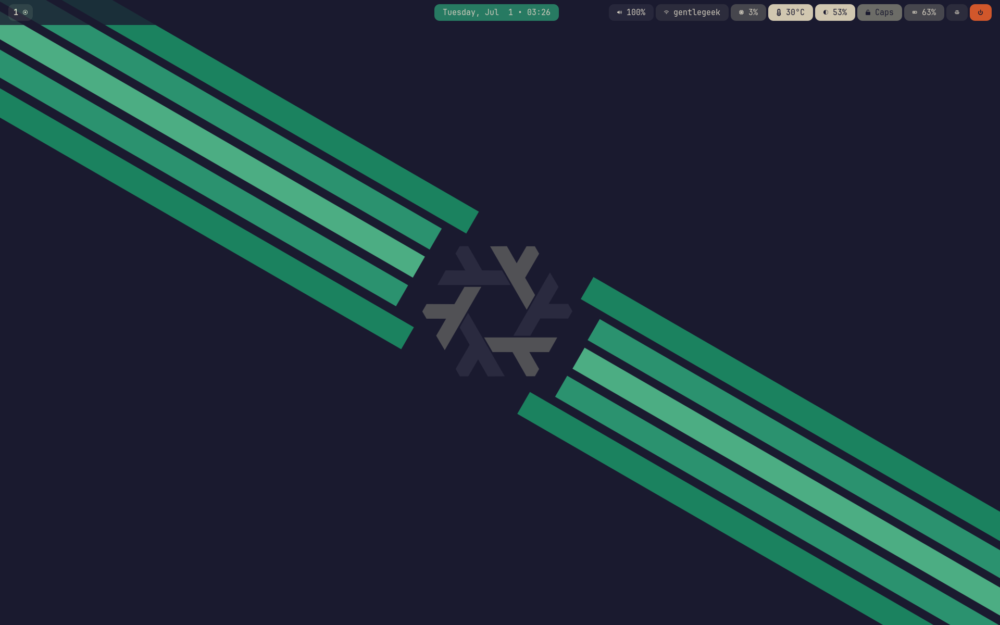
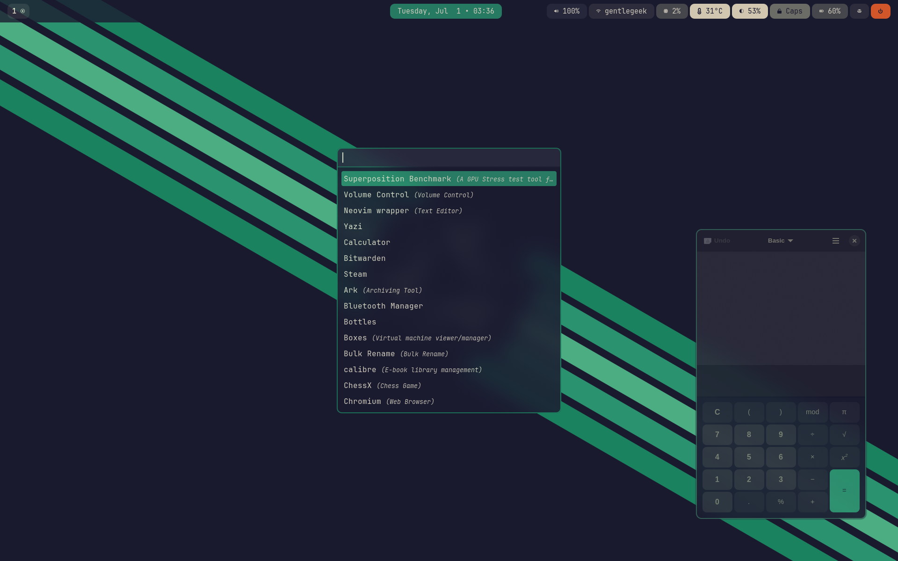

# gentleOS: My NixOS & Home Manager Configuration

This repository houses my personal NixOS and Home Manager configurations, designed for reproducible and declarative system management. It's structured to clearly separate host-specific settings from shared user configurations and common programs.

This project is very much a work in progress and a learning experience for me. Do not take anything you see in the repository as being prescriptive, I am learning Nix and NixOS in addition to proper "programming" methodology and structuring projects so while this is open source, I don't recommend copying anything from this repo in its current state. You've been warned lol

## Table of Contents

1.  [Overview](#overview)
2.  [Repository Structure](#repository-structure)
3.  [Key Features](#key-features)
4.  [Getting Started](#getting-started)
5.  [Contributing](#contributing)
6.  [License](#license)

## Overview

This repository serves as the central hub for managing my NixOS systems and Home Manager user environments. By leveraging the power of Nix, I aim to achieve a highly consistent, portable, and declarative configuration across all my machines.

This project is focused on utilizing Hyprland and declaring all necessary components and stylings within the declarative nature of NixOS but I've left my KDE config in here for the sake of posterity. I LOVE this declarative approach but it's also taking something hard (Hyprland configuration from scratch) and turns the difficulty up a notch with NixOS. I will attempt to document the hows and whys of the configurations within files themselves but at first, here's a few key highlights.

1. Hyprland configurations are located:
    - System level: hosts/shared/workstation/window-managers/hyprland. This is where system level packages and settings are defined. Base things that enable Hyprland to work for all users.
    - User level: home/shared/window-managers/hyprland. This is where user level settings are defined through Home Manager.
2. Theming is controlled by [Stylix](https://github.com/nix-community/stylix). There is probably a better way to do this but I only managed to get these settings down to two locations. One for Home Manager (modules/workstation/stylix.nix) and one for system level (hosts/shared/workstation/stylix/stylix.nix). You can choose your own base16 scheme and must change both places and run a `nixos-config rebuild switch` and `home-manager switch` with the appropriate options for your system for the new theme to take effect. I like to use [this theme preview page](https://tinted-theming.github.io/tinted-gallery/) to find good themes to try out but you can also create your own following Stylix documentation.

### Screenshots

## Repository Structure

[TODO]

## Key Features (or at least the goal...)

* **Declarative System Management**: All configurations are defined in Nix, ensuring reproducibility.
* **Modular Design**: Configurations are broken down into small, manageable modules for easy organization and reusability.
* **User and Host Separation**: Clear distinction between user-specific (Home Manager) and host-specific (NixOS) settings.
* **Shared Configurations**: Common program settings, services, and window manager configurations are centralized to avoid duplication.
* **Multiple Host Support**: Easily manage configurations for different machines (workstation, servers).

## Getting Started

[TODO]

## Contributing

Suggestions and contributions are welcome! If you have ideas for improving the structure, adding common modules, or fixing issues, please feel free to open an issue or pull request. I welcome the opportunity to learn from others!

## License

This project is licensed under the the [GPL 3 License](https://www.gnu.org/licenses/gpl-3.0.en.html).

