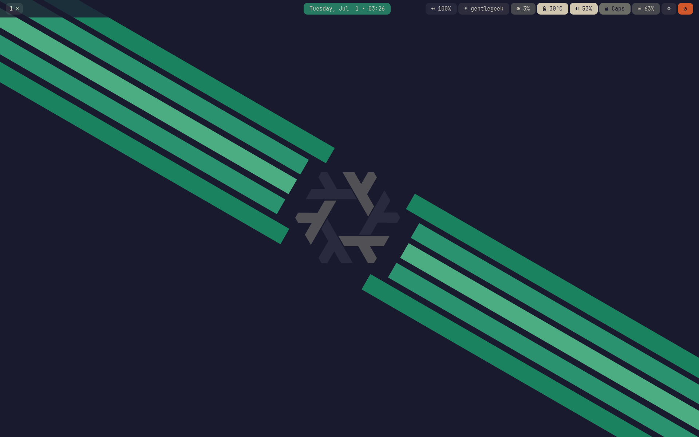
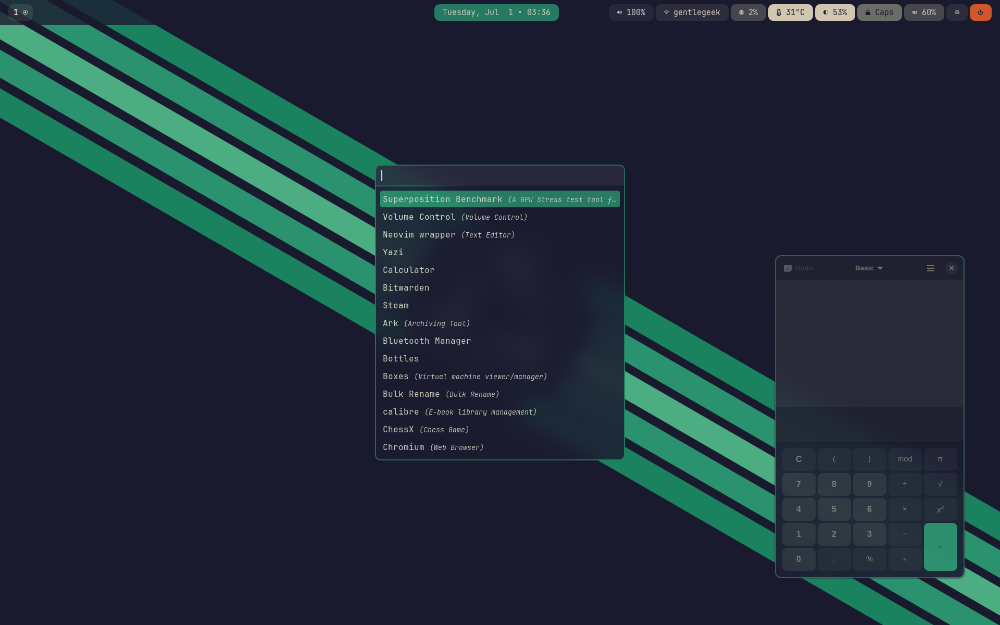
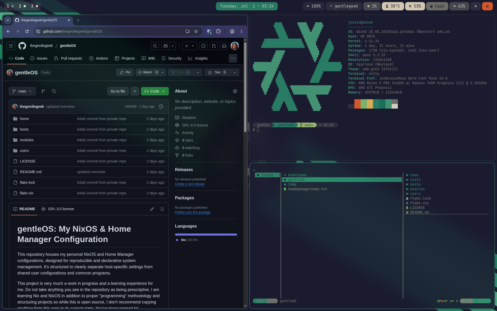
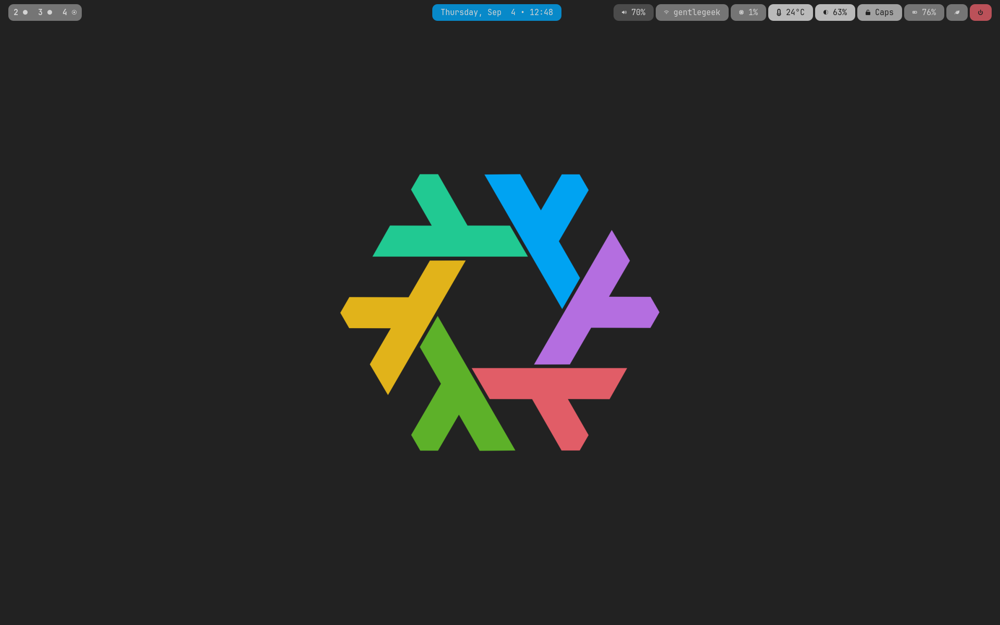
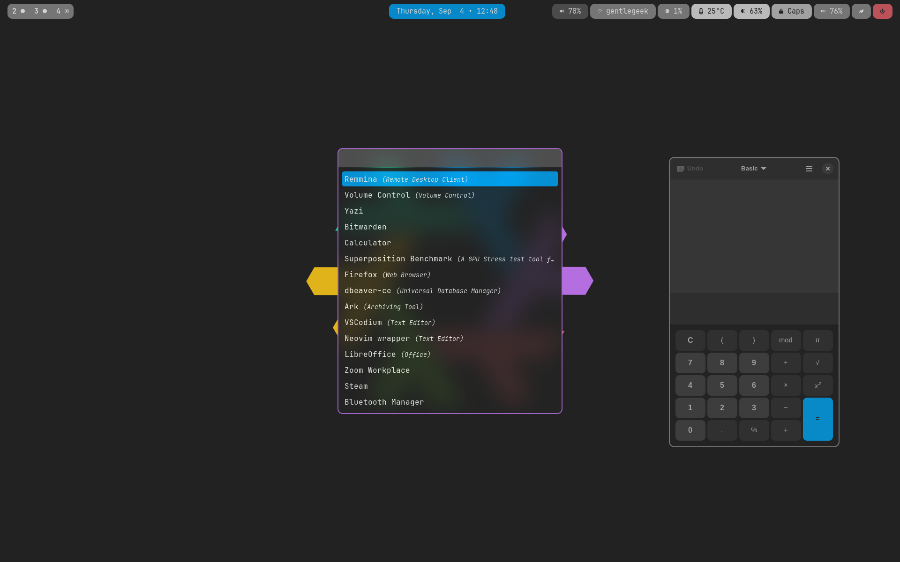
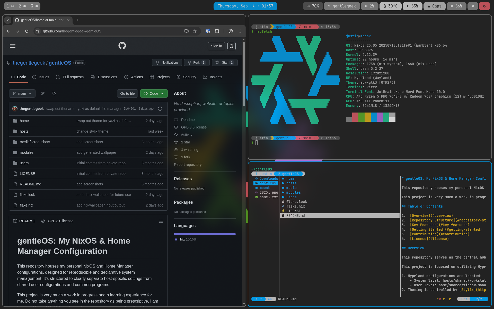

# gentleOS: My NixOS & Home Manager Configuration

This repository houses my personal NixOS and Home Manager configurations, designed for reproducible and declarative system management. It's structured to clearly separate host-specific settings from shared user configurations and common programs.

## Table of Contents

1. [Overview](#overview)
2. [Repository Structure](#repository-structure)
3. [Key Features](#key-features)
4. [Configured Hosts](#configured-hosts)
5. [Flake Inputs](#flake-inputs)
6. [Getting Started](#getting-started)
7. [Contributing](#contributing)
8. [License](#license)

## Overview

This repository serves as the central hub for managing my NixOS systems and Home Manager user environments. By leveraging the power of Nix, I aim to achieve a highly consistent, portable, and declarative configuration across all my machines.

This project is focused on utilizing Hyprland and declaring all necessary components and stylings within the declarative nature of NixOS but I've left my KDE config in here for the sake of posterity. I LOVE this declarative approach but it's also taking something hard (Hyprland configuration from scratch) and turns the difficulty up a notch with NixOS. I will attempt to document the hows and whys of the configurations within files themselves but at first, here's a few key highlights.

1. **Hyprland configurations are located:**
    - **System level:** `modules/nixos/window-managers/hyprland/` - This is where system level packages and settings are defined. Base things that enable Hyprland to work for all users (SDDM, Waybar, Thunar, system packages).
    - **User level:** `modules/home/window-managers/hyprland/` - This is where user level settings are defined through Home Manager (keybindings, Waybar styling, Rofi, Dunst notifications).

2. **Theming is controlled by [Stylix](https://github.com/danth/stylix).** The main Stylix configuration lives in `modules/shared/stylix.nix` and is imported by both NixOS system configurations and Home Manager. You can choose your own base16 scheme by editing this file and rebuilding:
    ```bash
    sudo nixos-rebuild switch --flake .#<hostname>
    ```
    I like to use [this theme preview page](https://tinted-theming.github.io/tinted-gallery/) to find good themes to try out but you can also create your own following Stylix documentation.

### Screenshots













## Repository Structure

```
gentleOS/
├── flake.nix                    # Main flake entry point - defines all hosts and home configs
├── flake.lock                   # Locked versions of all inputs
├── lib/
│   └── default.nix              # Helper functions (mkHost, mkHome)
├── hosts/                       # Host-specific NixOS configurations
│   ├── zbook/                   # Primary workstation laptop (Hyprland)
│   │   ├── default.nix          # Main host configuration
│   │   └── hardware-configuration.nix
│   ├── testing/                 # Steambox gaming system
│   ├── nixcloud/                # Linode VPS running Gitea
│   └── geigcraft-server/        # Dedicated Minecraft server
├── users/                       # User configurations
│   ├── justin/
│   │   ├── home.nix             # Home Manager configuration
│   │   └── system.nix           # NixOS user definition
│   └── jgeigley/
│       ├── home.nix
│       └── system.nix
├── modules/
│   ├── nixos/                   # NixOS system modules
│   │   ├── base.nix             # Base system config (flakes, shell aliases)
│   │   ├── boot/                # Bootloader configs (systemd-boot, grub)
│   │   ├── cli/                 # CLI tools (neovim, yazi, tmux, fzf, lazygit)
│   │   ├── cpu/                 # CPU-specific configs (AMD, Intel)
│   │   ├── workstation/         # Desktop essentials (sound, fonts, network, etc.)
│   │   ├── window-managers/     # WM configs (Hyprland system-level, KDE)
│   │   ├── gaming/              # Gaming (Steam, Minecraft, emulation)
│   │   ├── server/              # Server services (Gitea, Minecraft server)
│   │   └── browsers/            # Browser configs (Chromium)
│   ├── home/                    # Home Manager modules
│   │   ├── cli/                 # User CLI (kitty, fish, starship, nix-index)
│   │   ├── window-managers/     # WM user configs (Hyprland, Waybar, Rofi, Dunst)
│   │   ├── editors/             # Code editors (VSCode, Zed, opencode)
│   │   └── browsers/            # Browser user configs
│   └── shared/                  # Shared between NixOS & Home Manager
│       ├── stylix.nix           # Stylix theming configuration
│       └── wallpapers/          # Wallpaper images
├── pkgs/
│   └── default.nix              # Custom package definitions
├── overlays/
│   └── default.nix              # Nixpkgs overlays
└── media/
    └── screenshots/             # README screenshots
```

## Key Features (or at least the goal...)

* **Declarative System Management**: All configurations are defined in Nix, ensuring reproducibility.
* **Modular Design**: Configurations are broken down into small, manageable modules for easy organization and reusability.
* **User and Host Separation**: Clear distinction between user-specific (Home Manager) and host-specific (NixOS) settings.
* **Shared Configurations**: Common program settings, services, and window manager configurations are centralized to avoid duplication.
* **Multiple Host Support**: Easily manage configurations for different machines (workstations, servers).
* **Flake-based**: Uses Nix flakes for reproducible builds with pinned dependencies.
* **Unified Theming**: [Stylix](https://github.com/danth/stylix) provides consistent base16 theming across all applications.
* **Helper Functions**: Custom `mkHost` and `mkHome` functions in `lib/` simplify adding new hosts and users.

## Configured Hosts

| Host | Type | Description |
|------|------|-------------|
| `zbook` | Workstation | Primary laptop running Hyprland with full desktop environment |
| `testing` | Workstation | Steambox for gaming |
| `nixcloud` | Server | Linode VPS running Gitea git server |
| `geigcraft-server` | Server | Dedicated Minecraft server (uses nixpkgs unstable for latest server) |

## Flake Inputs

This configuration uses the following external inputs:

| Input | Version | Purpose |
|-------|---------|---------|
| `nixpkgs` | 25.11 | Main package repository (stable) |
| `unstable` | nixos-unstable | Unstable packages for specific hosts |
| `home-manager` | release-25.11 | User environment management |
| `stylix` | release-25.11 | System-wide theming with base16 |
| `nix-wallpaper` | latest | Auto-colorized wallpapers |
| `llm-agents` | latest | AI coding tools (opencode) |

## Getting Started

This section explains how to adapt this configuration for your own systems.

### Prerequisites

1. **Install NixOS** (or Nix on another Linux distribution)
   - For NixOS: Follow the [official NixOS installation guide](https://nixos.org/manual/nixos/stable/#sec-installation)
   - For Nix on other distros: Follow the [Nix installation guide](https://nixos.org/download.html)

2. **Enable Flakes**
   
   Flakes are still experimental. Add this to your `/etc/nixos/configuration.nix` (or use `nix.conf`):
   ```nix
   nix.settings.experimental-features = [ "nix-command" "flakes" ];
   ```
   Then rebuild: `sudo nixos-rebuild switch`

3. **Install Git**
   ```bash
   nix-shell -p git
   ```

### Adapting for Your Own System

1. **Fork and clone the repository**
   ```bash
   git clone https://github.com/YOUR_USERNAME/gentleOS.git
   cd gentleOS
   ```

2. **Generate your hardware configuration**
   ```bash
   sudo nixos-generate-config --show-hardware-config > hosts/YOUR_HOSTNAME/hardware-configuration.nix
   ```

3. **Create your host configuration**
   
   Create a new directory under `hosts/` for your machine:
   ```bash
   mkdir -p hosts/YOUR_HOSTNAME
   ```
   
   Create `hosts/YOUR_HOSTNAME/default.nix` based on an existing host (e.g., `zbook` for a workstation or `nixcloud` for a server). At minimum, you'll need:
   ```nix
   { pkgs, lib, inputs, config, ... }:
   {
     imports = [
       inputs.home-manager.nixosModules.home-manager
       ./hardware-configuration.nix
       ../../users/YOUR_USERNAME/system.nix
       ../../modules/nixos/base.nix
       # Add other modules as needed...
     ];
     
     networking.hostName = "YOUR_HOSTNAME";
     system.stateVersion = "25.11";  # Use your NixOS version
   }
   ```

4. **Create your user configuration**
   
   Create a directory under `users/`:
   ```bash
   mkdir -p users/YOUR_USERNAME
   ```
   
   Create `users/YOUR_USERNAME/system.nix` for NixOS user definition:
   ```nix
   { config, pkgs, ... }:
   {
     users.users.YOUR_USERNAME = {
       isNormalUser = true;
       description = "Your Name";
       extraGroups = [ "wheel" "networkmanager" ];
     };
     
     home-manager.users.YOUR_USERNAME = import ./home.nix;
   }
   ```
   
   Create `users/YOUR_USERNAME/home.nix` for Home Manager configuration (see `users/justin/home.nix` for a full example).

5. **Register your host in `flake.nix`**
   
   Add your host to the `nixosConfigurations` attribute:
   ```nix
   YOUR_HOSTNAME = lib.mkHost {
     hostname = "YOUR_HOSTNAME";
     extraModules = [
       inputs.stylix.nixosModules.stylix
     ];
   };
   ```

6. **Build and switch to your configuration**
   ```bash
   sudo nixos-rebuild switch --flake .#YOUR_HOSTNAME
   ```

### Standalone Home Manager (Optional)

If you want to use Home Manager independently (e.g., on a non-NixOS system):

1. Add your user to `homeConfigurations` in `flake.nix`:
   ```nix
   homeConfigurations = {
     "YOUR_USERNAME" = lib.mkHome {
       username = "YOUR_USERNAME";
     };
   };
   ```

2. Switch to your Home Manager configuration:
   ```bash
   home-manager switch --flake .#YOUR_USERNAME
   ```

### Customizing Your Theme

1. Edit `modules/shared/stylix.nix` to change the base16 color scheme:
   ```nix
   stylix = {
     enable = true;
     polarity = "dark";  # or "light"
     image = ./wallpapers/your-wallpaper.png;
     base16Scheme = "${pkgs.base16-schemes}/share/themes/YOUR_THEME.yaml";
   };
   ```

2. Browse available themes at [Tinted Theming Gallery](https://tinted-theming.github.io/tinted-gallery/)

3. Rebuild to apply:
   ```bash
   sudo nixos-rebuild switch --flake .#YOUR_HOSTNAME
   ```

### Common Commands

| Command | Description |
|---------|-------------|
| `sudo nixos-rebuild switch --flake .#HOSTNAME` | Build and switch to NixOS configuration |
| `sudo nixos-rebuild boot --flake .#HOSTNAME` | Build and set as boot default (doesn't switch now) |
| `sudo nixos-rebuild test --flake .#HOSTNAME` | Build and switch temporarily (reverts on reboot) |
| `home-manager switch --flake .#USERNAME` | Switch Home Manager configuration |
| `nix flake update` | Update all flake inputs to latest |
| `nix flake lock --update-input nixpkgs` | Update only nixpkgs input |

## Contributing

Suggestions and contributions are welcome! If you have ideas for improving the structure, adding common modules, or fixing issues, please feel free to open an issue or pull request. I welcome the opportunity to learn from others!

## License

This project is licensed under the the [GPL 3 License](https://www.gnu.org/licenses/gpl-3.0.en.html).

